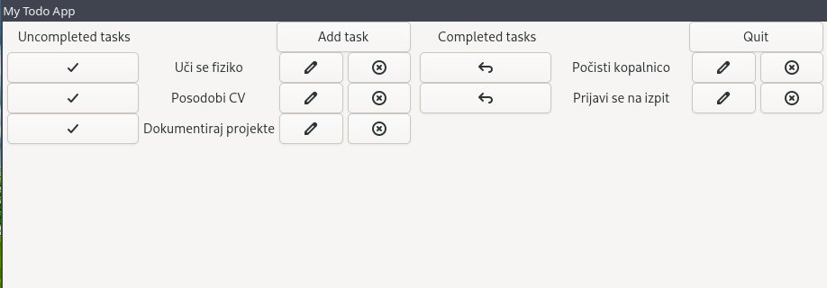
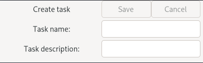

# Desktop Application for Task Tracking ("TODO App") - [Slovenian README](README_SLO.md)
The goal of the project was to develop an intuitive and simple desktop application for task tracking, allowing efficient organization and management of personal or professional tasks. 
Application is designed for the Linux environment and provides basic functionalities such as adding, editing, removing tasks and marking them as completed.

<p align="center">
  
</p>

## Functionalities:
- Adding tasks: The user can enter new tasks with a brief description.
- Editing tasks: The ability to change the task description after creation.
- Marking tasks as completed: The user can mark tasks as done.
- Removing tasks: Tasks that are no longer needed can be deleted.

## Technologies:
- C++
- Linux
- CMake
- GTK4

## Possible Upgrades:
- Introducing task priorities:
    - Adding the ability to set priorities (low, medium, high) for each task.
    - Color-coding and sorting tasks based on their priority.
- Task deadlines:
    - Allow setting a deadline for completing individual tasks.
    - Visual warnings or reminders for tasks whose deadline is approaching or has passed.
- Task history:
    - A record of all completed or removed tasks for later review.
    - Option to reactivate deleted tasks.
- Task statistics:
    - Overview of user performance (completed, incomplete, and overdue tasks).
    - Graphical display of progress over time.

## Key Benefits:
- Simplicity of the application: a simple GUI, logical even for novice users.
- Lightweight application: due to the implementation of only the most basic functions, the application is very light and works on even the weakest systems.
- Developed for Linux.

## Images  
<p align="center">
  
  <br>
  <br>
  <br>
  
</p>

## Usage
### Linux
```sh
./configure.sh # updates the CMAKE configuration
./build.sh # builds all the files
./run.sh # runs the program
```

## Sources
[GTK Getting started](https://www.gtk.org/docs/getting-started/hello-world/) <br>
[GTK4 Tutorial - github](https://github.com/ToshioCP/Gtk4-tutorial) <br>
GTK Documentation <br>
